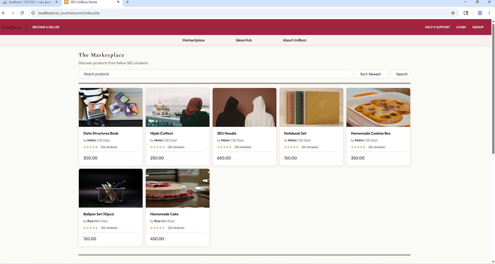
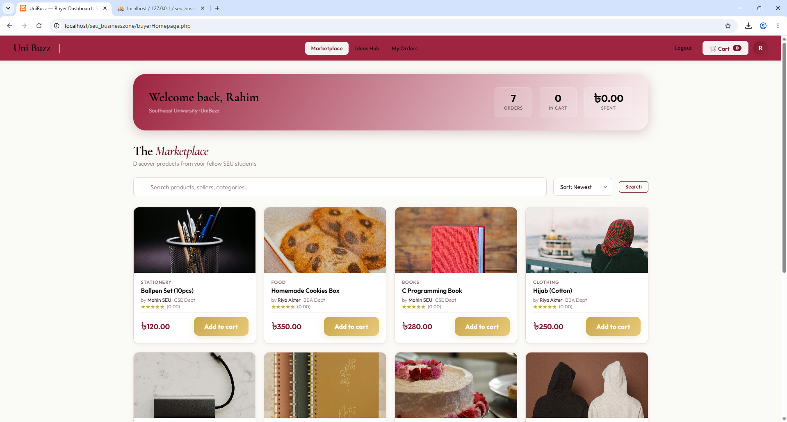
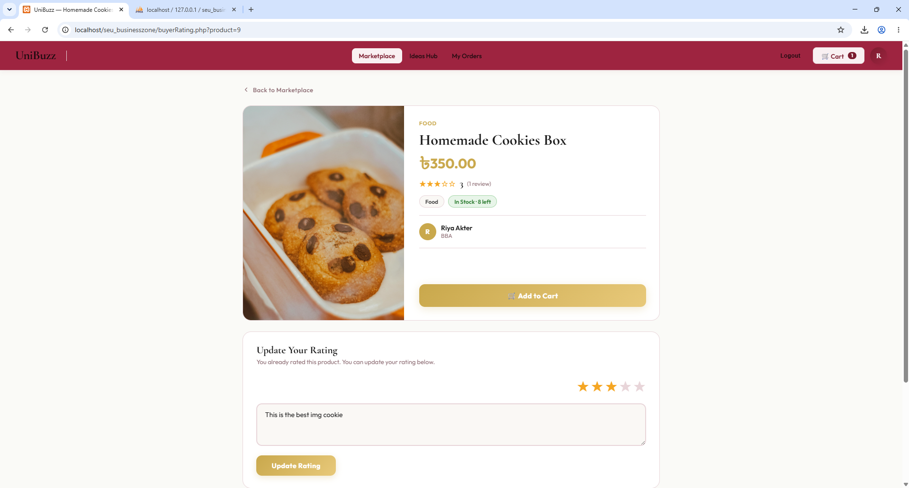
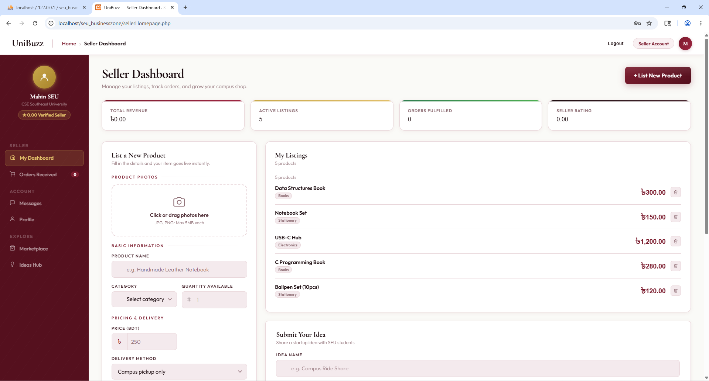
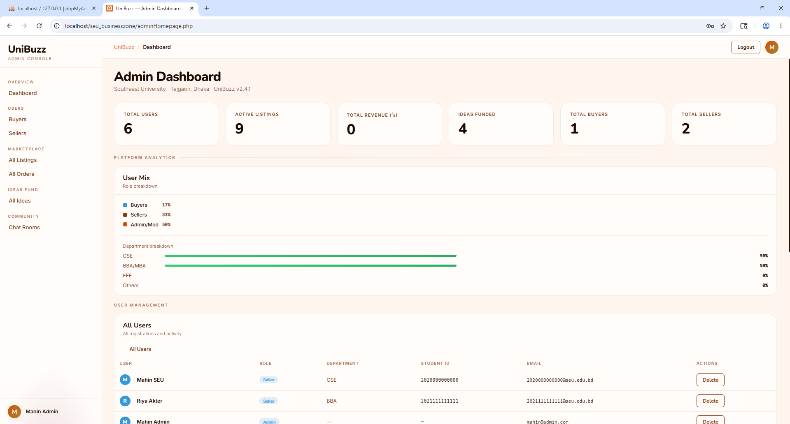

<div align="center">

# 🛍️ SEU UNIBUZZ

**A student-built eCommerce platform exclusively for Southeast University (SEU) business individuals**


</div>

---

## 📌 About The Project

**SEU UNIBUZZ** is a full-stack eCommerce web application built by students of Southeast University (SEU), designed exclusively for the SEU community. It provides a dedicated marketplace where SEU students and individuals can **buy**, **sell**, **share business ideas**, and **connect** — all within a trusted university ecosystem.

The platform supports three distinct user roles — **Admin**, **Seller**, and **Buyer** — each with their own dedicated dashboard and feature set.

---

## 📸 Screenshots

### 🏠 Guest Marketplace — Landing Page
> Browse all listings without logging in. Search, sort, and discover products from fellow SEU students.



---

### 🛒 Buyer Dashboard
> Personalized welcome, quick stats (orders, cart, amount spent), and a full marketplace with Add to Cart functionality.



---

### ⭐ Product Detail & Rating Page
> View product info, seller details, stock availability, and leave or update a star rating with a written review.



---

### 🏪 Seller Dashboard
> Manage active listings, list new products with photos, track revenue and orders, and submit business ideas — all in one place.



---

### 🔧 Admin Dashboard
> Full platform overview with user mix analytics, department breakdown charts, and a complete user management table.



---

## ✨ Features

### 👤 Three User Roles
- **Admin** — Platform analytics, user management (buyers & sellers), listings & order oversight, idea moderation
- **Seller** — List products with photos & categories, track orders & revenue, manage profile, submit ideas
- **Buyer** — Browse marketplace, search & filter products, add to cart, place orders, rate products, add wallet funds

### 🛒 Marketplace
- Guest access to browse all listings (no login required)
- Authenticated buyers get a personalized dashboard with order & cart stats
- Product cards show category, seller name, department, star ratings, and price
- Sort by newest and search by product/seller/category

### ⭐ Product Ratings
- Buyers can rate products with 1–5 stars and leave written reviews
- Ratings update live on the product detail page
- Sellers' overall rating is calculated from all product reviews

### 💡 Ideas Hub
- Sellers can post startup/business ideas
- Visible to the entire SEU community
- Admin can moderate and manage submitted ideas

### 💬 Global Chat Room
- Community chat for all platform users
- Connect with fellow SEU students and entrepreneurs in real time

### 🛡️ Admin Console
- Live stats: total users, active listings, revenue, ideas funded, buyer/seller counts
- User mix and department breakdown analytics (CSE, BBA/MBA, EEE, etc.)
- Full user table with role, department, student ID, email, and delete action

---

## 🗂️ Project Structure

```
SEU-UNIBUZZ/
│
├── index.php                  # Landing / guest marketplace
├── login.php                  # Login page
├── logout.php                 # Logout handler
├── registration.php           # New user registration
├── signup.php                 # Signup logic
├── database.php               # Database connection
│
├── 🔵 Buyer Pages
│   ├── buyerHomepage.php      # Buyer dashboard + marketplace
│   ├── buyerCart.php          # Shopping cart
│   ├── buyerOrder.php         # Order history
│   ├── buyerFund.php          # Add wallet funds
│   ├── buyerIdea.php          # Browse ideas
│   └── buyerRating.php        # Product detail + rating
│
├── 🟢 Seller Pages
│   ├── sellerHomepage.php     # Seller dashboard + list product
│   ├── sellerMarketplace.php  # Seller's marketplace view
│   ├── sellerOrder.php        # Incoming orders
│   ├── sellerIdeahub.php      # Submit/manage ideas
│   └── sellerProfile.php      # Seller profile
│
├── 🔴 Admin Pages
│   ├── adminHomepage.php      # Admin dashboard + analytics
│   ├── adminAllListings.php   # Manage all listings
│   ├── adminAllOrders.php     # Manage all orders
│   ├── adminBuyers.php        # Manage buyers
│   ├── adminSellers.php       # Manage sellers
│   └── adminIdeas.php         # Moderate ideas
│
├── 🌐 Global Pages
│   ├── marketplaceG.php       # Public marketplace
│   ├── ideashubG.php          # Public ideas hub
│   ├── globalChatRoom.php     # Community chat
│   └── helpAndSupport.html    # Help & support page
│
├── 🎨 Stylesheets
│   ├── index.css, login.css, registration.css
│   ├── buyerDash.css, sellerDash.css, adminDash.css
│   ├── globalChatRoom.css, helpAndSupport.css
│
└── images/                    # Screenshot assets for README
```

---

## 🚀 Getting Started

### Prerequisites

- PHP >= 7.4
- MySQL / MariaDB
- Apache or Nginx — **XAMPP / WAMP recommended** for local development

### Installation

1. **Clone the repository**
   ```bash
   git clone https://github.com/nahiyan-al-mahin/SEU-UNIBUZZ.git
   ```

2. **Move to your server's web root**
   ```bash
   # Example for XAMPP on Windows
   mv SEU-UNIBUZZ C:/xampp/htdocs/seu_businesszone
   ```

3. **Set up the database**
   - Create a MySQL database (e.g., `seu_unibuzz`)
   - Import the SQL schema (if provided)
   - Update `database.php` with your credentials:
     ```php
     $host     = "localhost";
     $user     = "root";
     $password = "";
     $dbname   = "seu_unibuzz";
     ```

4. **Run the project**
   - Start Apache and MySQL in XAMPP
   - Open your browser: `http://localhost/seu_businesszone`

---

## 🛠️ Tech Stack

| Layer | Technology |
|-------|-----------|
| Frontend | HTML5, CSS3 |
| Backend | PHP (Server-side scripting) |
| Database | MySQL |
| Server | Apache (via XAMPP/WAMP) |

---

## 👥 Contributors

Made with ❤️ by students of **Southeast University (SEU), Dhaka, Bangladesh**

---

## 📄 License

This project is open source and available under the [MIT License](LICENSE).

---

<div align="center">
  <sub>Built for the SEU community 🎓 · UniBuzz v2.4.1</sub>
</div>
